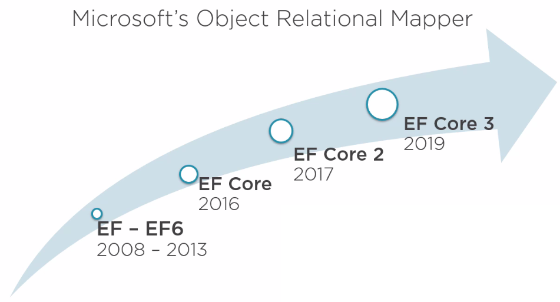

# military-entity-framework-core
 
Step by step tutorials creating Entity framework core

## Table of Contents

- [Sending Feedback](#sending-feedback)
- [About Entity Framework Core](#about-entity-framework-core)
- [Sample application with each labs](#sample-application-with-each-steps)
    - Creating Entity Framework Core
        - [Step 1 - Create Application](#step-1---create-application)
    - Controlling database creation and Schema changes
        - [Step 2 - Adding EntityFramework via Nuget ](#step-2---adding-entityframework-via-nuget)
        - [Step 3 - Create Console App](#step-3---adding-migration)
        - [Step 4 - Adding migration](#step-4---adding-migration)
        - [Step 5 - Script migration for production DB](#step-5---script-migration-for-production-db)
        - [Step 6 - Reverse engineering from existing database](#step-6---reverse-engineering-from-existing-database)
    - Mapping many to mmany and one to one relationship
        - [Step 7 - Many to many relationship](#step-7---many-to-many-relationship)
        - [Step 8 - One to one relationship](#step-8---one-to-one-relationship)
        - [Step 9 - Visualising how EF Core model looks](#step-9---visualising-how-ef-core-model-looks)
        - [Step 10 - Running Migration for Model changes](#step-10---running-migration-for-model-changes)
    - Interacting with EF Core data model
        - [Step 11 - Adding logging to EF Core's](#step-11---adding-logging-to-ef-cores)
        - [Step 12 - For bulk operations](#step-12---for-bulk-operations)
        - [Step 13 - Understading queries](#step-13---understading-queries)
        - [Step 14 - Aggregating in Queries](#step-14---aggregating-in-queries)
        - [Step 15 - Updating object](#step-15---updating-object)
        - [Step 16 - Deleting object](#step-16---deleting-object)
    - Interacting with Related Data
        - []
    - Working with Views and Stored Procedures and Raw SQL
        - []
     

## Sending Feedback

For feedback can drop mail to my email address amit.naik8103@gmail.com or you can create [issue](https://github.com/Amitpnk/angular-application/issues/new)

## About Entity Framework Core

* EF Core is an ORM (Object Relation Mapper)
* Microsoft's official data access technology for .NET development
* It is cross-platform (design and deploy on Windows, macOS & Linux)

### Benefits of EF Core
 * Developer productivity
 * Coding consistency

### Evolution of EF Core



## Sample application with each steps

### Step 1 - Create Application

* Create Blank solution
* Class library .NET Standard
    * MilitaryApp.Domain
    * MilitaryApp.Data (Latest version on .Net standard - 2.1)

### Step 2 - Adding Nuget package manager

* Install Microsoft.EntityFrameworkCore.SqlServer to <b>MilitaryApp.Data</b> Class library <br/>
(As Microsoft.EntityFrameworkCore.SqlServer is dependent on Microsoft.EntityFrameworkCore.Relational and it is dependent on Microsoft.EntityFrameworkCore.Core, so we can add one Microsoft.EntityFrameworkCore.SqlServer nuget package manager)

and Add class in <b>MilitaryApp.Domain</b>

```C#
public class Military
{
    public Military()
    {
        Quotes = new List<Quote>();
    }
    public int Id { get; set; }
    public string Name { get; set; }
    public List<Quote> Quotes { get; set; }
    public King King { get; set; }
}

public  class King
{
    public int Id { get; set; }
    public string KingName { get; set; }
}

public class Quote
{
    public int Id { get; set; }
    public string Text { get; set; }
    public Military Military { get; set; }
    public int MilitaryId { get; set; }
}
```

and Add MilitaryContext.cs in <b>MilitaryApp.Data</b>

```C#
public class MilitaryContext : DbContext
{
    public DbSet<Military> Militaries { get; set; }
    public DbSet<Quote> Quotes { get; set; }
    public DbSet<King> Kings { get; set; }

    protected override void OnConfiguring(DbContextOptionsBuilder optionsBuilder)
    {
        optionsBuilder
            .UseSqlServer("Data Source=(local)\\SQLexpress;Initial Catalog=MilitaryDB;Integrated Security=True");
    }
}
```

Use EF Core Power Tool Extension for VS 2019

### Step 3 - Create Console App 

Create console app and make it as default project

```C#
class Program
    {
        static MilitaryContext context = new MilitaryContext();
        static void Main(string[] args)
        {
            context.Database.EnsureCreated();
            GetMilitary("Before Add: ");
            AddMilitary();
            GetMilitary("After Add: ");
        }

        private static void GetMilitary(string text)
        {
            var militarys = context.Militaries.ToList();
            Console.WriteLine($"{text}: Military Count is {militarys.Count}");

            foreach (var military in militarys)
            {
                Console.WriteLine(military.Name);
            }
        }

        private static void AddMilitary()
        {
            var militarys = new Military { Name = "Amit" };
            context.Militaries.Add(militarys);
            context.SaveChanges();
        }
    }

```

### Step 4 - Adding migration

* Install Microsoft.EntityFrameworkCore.Tools to <b>MilitaryApp.Data</b> Application <br/>
* Install Microsoft.EntityFrameworkCore.Design to <b>Console</b> Application <br/>

* Make it Console application as default project
* In Package Manager console run below command, under <b>MilitaryApp.Data</b>
    * Add-Migration init
    * Update-Database


### Step 5 - Script migration for production DB

If we want to get SQL script

* In Package Manager console, run below command
    * script-migration

### Step 6 - Reverse engineering from existing database

* Class library .NET Standard as MilitaryApp.ReverseEnggData and reference this to ConsoleApp
* In Package Manager console in MilitaryApp.ReverseEnggData, run below command

```PS
scaffold-dbcontext -provider Microsoft.EntityFrameworkCore.SqlServer -connection "Data Source=(local)\SQLexpress;Initial Catalog=MilitaryDB;Integrated Security=True"
```

### Step 7 - Many to many relationship

```C#
public class MilitaryBattle
{
    public int MilitaryId { get; set; }
    public int BattleId { get; set; }
    public Military Military { get; set; }
    public Battle Battle { get; set; }
}

public class Military
{
    public Military()
    {
        Quotes = new List<Quote>();
        MilitaryBattles = new List<MilitaryBattle>();
    }
    public int Id { get; set; }
    public string Name { get; set; }
    public List<Quote> Quotes { get; set; }
    public King King { get; set; }
    public List<MilitaryBattle> MilitaryBattles { get; set; }
}

public class Battle
{
    public Battle()
    {
        MilitaryBattles = new List<MilitaryBattle>();
    }
    public int Id { get; set; }
    public string Name { get; set; }
    public DateTime StartDate { get; set; }
    public DateTime EndDate { get; set; }
    public List<MilitaryBattle> MilitaryBattles { get; set; }
}
```

in MilitaryContext.cs
```C#
...
public DbSet<Battle> Battles { get; set; }

protected override void OnModelCreating(ModelBuilder modelBuilder)
    {
        modelBuilder.Entity<MilitaryBattle>().HasKey(m => new { m.MilitaryId, m.BattleId });
    }
```


### Step 8 - One to one relationship

```C#
public class Military
{
    ...
    public Horse Horse { get; set; }
}

public class Horse
{
    public int Id { get; set; }
    public string Name { get; set; }
    public int MilitaryId { get; set; }
}
```


in MilitaryContext.cs
```C#
...
public DbSet<Horse> Horses { get; set; }
```

Note: Anyother way we can mapping via model binder
```C#
// Other options to create table is via modelbuilder
modelBuilder.Entity<Horse>().ToTable("Horses");
```

### Step 9 - Visualising how EF Core model looks

* Install DGML editor in VS 2019 setup file (available in individual components)
* Install EF Core Power Tools via Extension
* Make multi target to netcoreapp3.1,netstandard2.0
* Add Microsoft.EntityFrameworkCore.Design lib via nuget package manager
* Create *.dgml file by right click on MilitaryApp.Data > EF Core Power Tools > Add DbContext Model diagram

### Step 10 - Running Migration for Model changes

* In Package Manager console in MilitaryApp.Data , run below command
    * Add-Migration modification_v1
    * Update-Database

### Step 11 - Adding logging to EF Core's 

Micorsoft.Extensions.Logging lib is already available in ASP.NET CORE

* Install below lib to <b>MilitaryApp.Data</b> Class library <br/>
    * Micorsoft.Extensions.Logging
    * Micorsoft.Extensions.Logging.Console

Add below code snippet to MilitaryApp.Data 

```c#
      protected override void OnConfiguring(DbContextOptionsBuilder optionsBuilder)
        {
            optionsBuilder
                .UseLoggerFactory(ConsoleLoggerFactory)
                // For enabling sensitive data
                .EnableSensitiveDataLogging()
                .UseSqlServer("Data Source=(local)\\SQLexpress;Initial Catalog=MilitaryDB;Integrated Security=True");
        }

        // protected override void OnConfiguring(DbContextOptionsBuilder optionsBuilder)
        // {
        //     optionsBuilder
        //         .UseLoggerFactory(ConsoleLoggerFactory)
        //         .UseSqlServer("Data Source=(local)\\SQLexpress;Initial Catalog=MilitaryDB;Integrated Security=True");
        // }
```

### Step 12 - For bulk operations

Atleast 4 operations is needed for bulk operations,

```c#
    private static void InsertMulitipleMilitary()
    {
        // Atleast 4 operations is needed for bulk operations 
        var military1 = new Military { Name = "Military 1" };
        var military2 = new Military { Name = "Military 2" };
        var military3 = new Military { Name = "Military 3" };
        var military4 = new Military { Name = "Military 4" };

        // alterante way
        //var militaries = new List<Military>();
        //militaries.Add(military1);
        //militaries.Add(military2);
        //context.Militaries.AddRange(militaries);
            
        context.Militaries.AddRange(military1, military2, military3, military4);
        context.SaveChanges();
    }

    private static void InsertVariousType()
    {
        // For inserting to military table
        var militarys = new Military { Name = "Military 5 with king 1" };
        var kings = new King { KingName = "King1" };
        context.AddRange(militarys,kings);
        context.SaveChanges();
    }
```

### Step 13 - Understading queries

Internally EF core does cache queries to reduce repeating effort in same application instance

```c#
    // LINQ Methods
    context.Militaries.ToList();

    context.Militaries
    .Where(m=>m.Name =="Amit")
    .ToList();

    // LINQ Query Syntax
    (from m in context.Militaries
    select m).ToList();

    (from m in context.Militaries
    where m.Name == "Amit"
    select m).ToList();

    // For parameterised queries, pass value with variable
    var name = "Amit";
    context.Militaries
    .Where(m=>m.Name ==name)
    .ToList();

    // Like operator
    context.Militaries.Where(x => EF.Functions.Like(x.Name, "Am%")).ToList();
```

### Step 14 - Aggregating in Queries

    * ToList()
    * First()
    * FirstOrDefault()
    * Single()
    * SingleOrDefault()
    * Last()
    * LastOrDefault()
    * Count()
    * LongCount()
    * Min(), Max()
    * Average(), Sum()

    DB set method that will execute
    * Find(keyValue)

```c#
    // Select top 1 * ...
    context.Militaries.Where(m=>m.Name =="Amit")
    .FirstOrDefault();
    // or
    context.Militaries.FirstOrDefault(m=>m.Name =="Amit");

    // find ID
    context.Militaries.Find(2);

    // Order by with LastOrDefault
    context.Militaries.OrderBy(m=>m.Id)
    .LastOrDefault(m=>m.Name =="Amit");

    // For pagination Skip and Take
     var militaries = context.Militaries.Skip(0).Take(3).ToList();
            militaries.ForEach(m => m.Name += " update ");
```

### Step 15 - Updating object

```c#
    var militaries = context.Militaries.FirstOrDefault();
    militaries.Name += "Name";
    context.Militaries.Find(2);
```

### Step 16 - Deleting object

```c#
    var militaries = context.Militaries.FirstOrDefault();
    context.Militaries.Remove(militaries);
    context.SaveChanges();
```

### Step 17 - Inserted related data

```c#
private static void InsertNewMilitaryWithQuote()
{
    var military = new Military
    {
        Name = "Marathas",
        Quotes = new List<Quote>
        {
            new Quote {Text ="To save country"}
        }
    };
    _context.Militaries.Add(military);
    _context.SaveChanges();
}

private static void AddQuoteToExistingMilitary()
{
    var quote = new Quote
    {
        Text = "To save nation",
        MilitaryId = 15
    };
    using (var newContext = new MilitaryContext())
    {
        newContext.Quotes.Add(quote);
        newContext.SaveChanges();
    }
}
```

### Step 18 - Eager loading related data

```c#
private static void EagerLoadMilitaryWithQuotes()
{
    // left join
    var militaryQuotes = _context.Militaries
        .Include(s => s.Quotes).ToList();

    var militaryQuotesLeftJoin = _context.Militaries
        .Include(s => s.Quotes)
        .Include(s => s.King).ToList();

}

```

### Step 19 - Using Related Data to Filter Objects

```c#
private static void FilteringWithRelatedData()
{
    var military = _context.Militaries
        .Where(s => s.Quotes.Any(q => q.Text.Contains("Happy")))
        .ToList();
}

```

## Working with Views and Stored Procedures and Raw SQL


### Step 20 -Adding Views and Other Database Objects Using Migrations

* In Package Manager console in MilitaryApp.Data , run below command
    * add-migration modification_addSqlView_Func_v2
    
```C#
public partial class modification_addSqlView_Func_v2 : Migration
{
    protected override void Up(MigrationBuilder migrationBuilder)
    {
        migrationBuilder.Sql(
            @"create function dbo.funJoinColumnInfo  
                (
                    @name nvarchar(50),
                )
                returns nvarchar(100)
                as
                begin return (select @name)  
                end ");
        migrationBuilder.Sql(
            @"CREATE OR ALTER VIEW dbo.getBattle
                AS 
                SELECT * from military
            ");
    }

    // Incase if you want to revoke migration
    protected override void Down(MigrationBuilder migrationBuilder)
    {
        migrationBuilder.Sql("DROP VIEW dbo.getBattle");
        migrationBuilder.Sql("DROP FUNCTION dbo.funJoinColumnInfo")
    }
}
```

### Step 21 - Using Keyless Entities to Map to Views

Connect SQL view to db context, using keyless entities

```c#
namespace MilitaryApp.Domain
{
    public class ViewMilitary
    {
        public string Name { get; set; }
        public King King { get; set; }
      
    }
}
```

```c#
public class MilitaryContext : DbContext
{
    public DbSet<ViewMilitary> viewMilitary { get; set; }

    protected override void OnModelCreating(ModelBuilder modelBuilder)
    {
        // ...

        modelBuilder.Entity<ViewMilitary>().HasNoKey().ToView("getBattle");
    }
}
```

### Step 22 - Querying the Database Views

```c#
private static void QuerySQLView()
{
    var military = _context.viewMilitary.FirstOrDefault();
}
```

### Step 23 - Querying with Raw SQL

```c#
private static void QueryUsingRawSql()
{
    var military = _context.Militaries
    .FromSqlRaw("select Name from military").ToList();

}

private static void QueryUsingRawSqlWithInterpolation()
{
    string name = "amit";
    var military = _context.Militaries
        .FromSqlInterpolated($"select Name from military where name {name}").ToList();

}
```

### Step 23 - Running Stored Procedure Queries with Raw SQL

* In Package Manager console in MilitaryApp.Data , run below command
    * add-migration modification_addSqlProcedure_v3
    
```C#
public partial class modification_addSqlProcedure_v3 : Migration
{
    protected override void Up(MigrationBuilder migrationBuilder)
    {
        migrationBuilder.Sql(
            @"create PROCEDURE dbo.uspGetMilitary
                @militaryId int
                AS
                    SELECT militaryId, name from military
                    WHERE militaryId = @militaryId
            ");
    }

    // Incase if you want to revoke migration
    protected override void Down(MigrationBuilder migrationBuilder)
    {
        migrationBuilder.Sql("DROP PROCEDURE dbo.uspGetMilitary")
    }
}
```

```c#
private static void QueryUsingFromRawSqlProcedure()
{
    string name = "amit";
    var military = _context.Militaries
        .FromSqlRaw($"EXEC dbo.uspGetMilitary {name}").ToList();
}

// Recommended
private static void InterpolatedRawSqlQueryStoredProc()
{
    string name = "amit";
    var military = _context.Militaries
        .FromSqlInterpolated($"EXEC dbo.uspGetMilitary {name}").ToList();
}
```

### Step 24 - Executing Non-Query Raw SQL Commands

```c#
private static void ExecuteSomeRawSql()
{
    string name = "amit";
    var military = _context.Database
        .ExecuteSqlInterpolated($"EXEC dbo.DeleteMilitary {name}");
}
```

